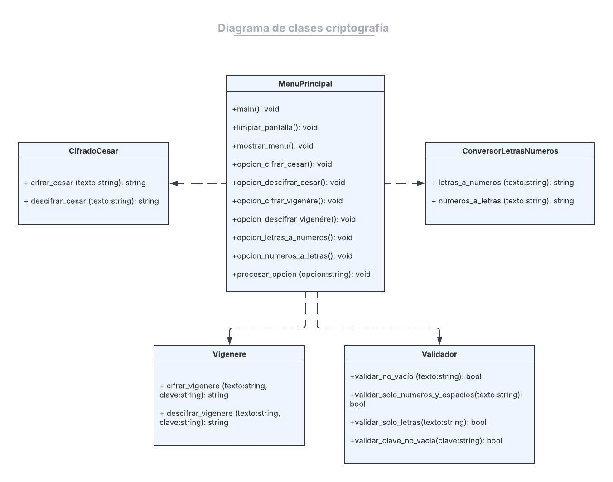
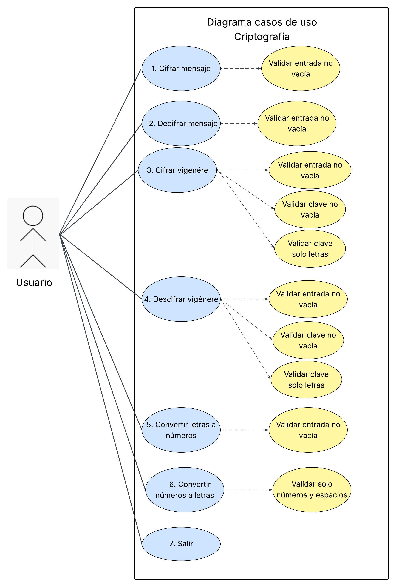

# Criptografía

# Integrantes

- Madeline Cordero Ruiz
- Nazareth Artavia Pérez
- Kendall Solano Solís
- Pamela Rojas Quesada
- Daniela Siles Guillén

# Cómo ejecutar el programa

  1. Abrir el editor Lucia

  2. Presionar el botón **Run** para ejecutar el programa

  3. Seleccionar una opción del menú principal:

     ## 1. Cifrar mensaje
      El sistema mostrará la siguiente opción:
   
      - Ingrese el mensaje a cifrar
   
      Después de ingresar el texto, el programa generará automáticamente el mensaje cifrado

     ## 2. Descifrar mensaje
     El sistema mostrará la siguiente opción:
   
     - Ingrese el mensaje a descifrar
   
     Después de ingresar el texto cifrado, el programa mostrará el mensaje descifrado
     

     ## 3. Cifrado Vigenére
     El sistema mostrará la siguiente opción:

     Ingrese el mensaje
     Ingrese la clave secreta

     El programa cifrará el mensaje utilizando el método polialfabético de Vigenére
     

     ## 4. Descifrado Vigenére
     El sistema mostrará la siguiente opción:

     Ingrese el mensaje cifrado
     Ingrese la clave secreta

     El programa recuperará el mensaje original utilizando la misma clave

     ## 5. Convertir LETRAS a NÚMEROS
      El sistema mostrará la siguiente opción:
   
     - Ingrese la palabra o frase
   
      El programa convertirá cada letra en su equivalente numérico

     ## 6. Convertir NÚMEROS a LETRAS
     El sistema mostrará la siguiente opción:
   
     - Ingrese los números separados por espacios
   
     El programa convertirá los números en letras

     ## 7. Salir
     Permite cerrar el programa de forma segura

# Funcionalidades implementadas

  ## 1. Cifrado César
  Permite cifrar mensajes utilizando un desplazamiento de 3 posiciones

  ## 2. Descifrado César
  Permite recuperar el mensaje original de un texto cifrado

  ## 3. Cifrado Vigenére
  Permite cifrar mensajes utilizando una palabra clave, aplicando múltiples desplazamientos sobre las letras del mensaje para aumentar la seguridad

  ## 4. Descifrado Vigenére
  Permite recuperar el mensaje original utilizando la misma clave usada durante el cifrado

  ## 5. Conversión de letras a números
  Convierte cada letra según su posición en el alfabeto

  ## 6. Conversión de números a letras
  Convierte números en letras del alfabeto

  ## 7. Validación de errores
  El sistema valida:
    - Campos vacíos
    - Opciones inválidas
    - Entradas incorrectas
    - Límite de intentos

    
## Diagrama de clases

## Diagrama de casos de uso

# Mejoras en versión 2.0
- Interfaz gráfica
- Guardar mensajes cifrados en archivos
- Base de datos para historial de conversiones

  
